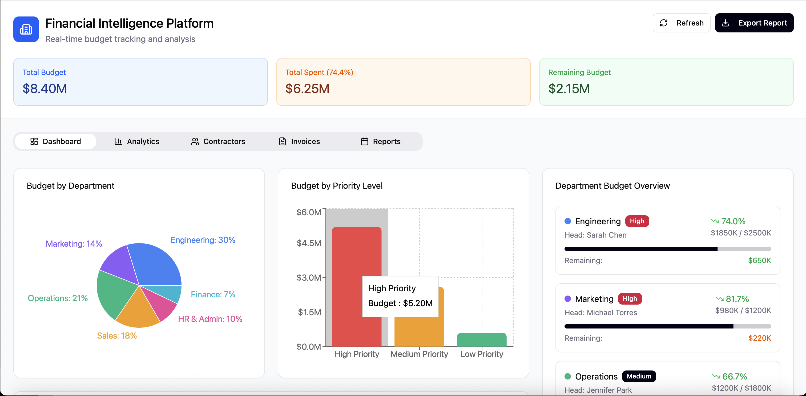
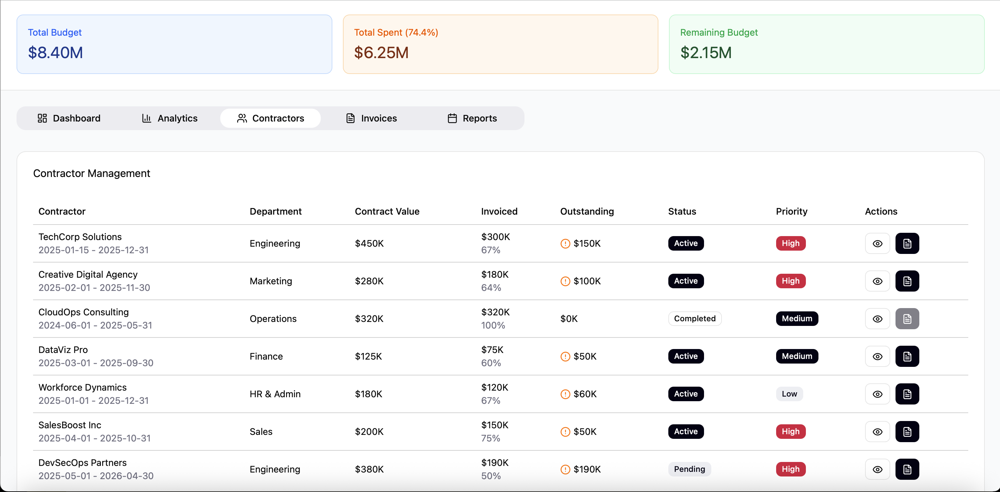
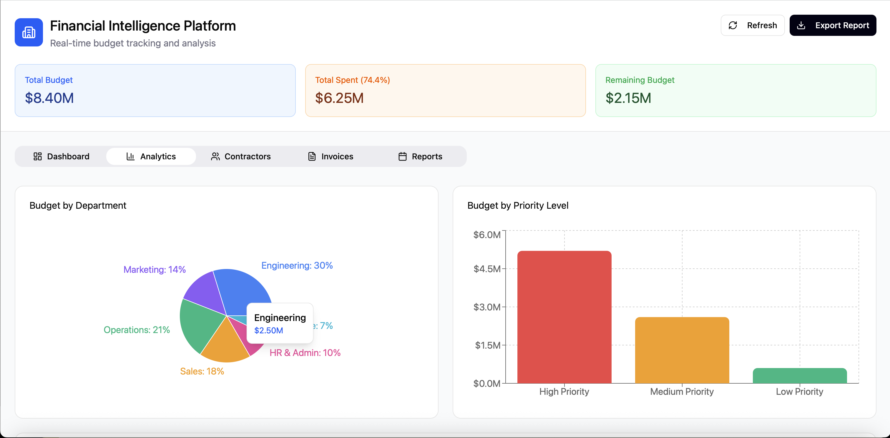
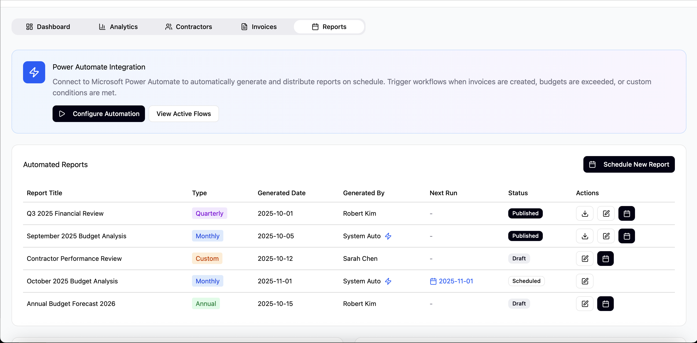

# Financial Intelligence Platform  
A modern financial analytics and reporting system built with a Figma-generated front-end, a custom SQL-backed data layer, and interactive dashboards for real-time insights.

This platform processes raw financial data (CSV, Excel, and API sources), transforms it through ETL workflows, and visualizes spending, budgets, contractor activity, and trends through rich UI components. I am currently developing the backend services that will power the full data pipeline.

---

## Overview

This project is a **full financial analytics platform** designed to help organizations manage budgets, contracts, invoices, and operational spending.

The front-end was initially generated from **Figma** using an automated component-conversion workflow. I then refined the codebase manually to improve structure, styling, state management, and data flow.

The system is built to follow the same workflow used in business intelligence tools:

> **data → clean → transform → visualize**

The goal is to support clear decision-making through charts, forecasting tools, and automated reporting.

---

## Figma-Generated UI

All UI components were first designed in Figma and then converted into React + Tailwind code.  
This allowed the interface to match modern SaaS dashboards while keeping development fast, clean, and consistent.

After generation, I restructured the layout, optimized styles, and added:

- dynamic tables  
- interactive charts  
- tabs, filters, status labels  
- automated report sections  
- navigation and state flow  

---

## Tech Stack

### **Front-End**
- **React + TypeScript**
- **Vite**
- **TailwindCSS**
- **shadcn/ui**
- **Recharts** (visualizations)
- **Lucide Icons**
- **React Router**

### **Back-End (in progress)**
- **Node.js / TypeScript**
- **Prisma ORM**
- **PostgreSQL**
- **REST APIs** for data ingestion and reporting
- ETL pipelines for CSV, Excel, and API sources

### **Other Tools**
- Figma → React code generation
- Power Automate integration (UI prototype)
- Workflow documentation and diagrams
- Forecasting logic (planned)

---

## Screenshots

### **Dashboard Overview**

### **Contractor Management**

### **Budget Analytics**

### **Automated Reporting**

---

## How It Works

### **1. Data Ingestion**
The system is designed to accept data from:
- CSV files  
- Excel sheets  
- API endpoints  
- Manual entries  

These inputs flow into an ETL pipeline (backend in development).

### **2. Data Processing (Backend – in progress)**
- Cleaning  
- Validating  
- Merging datasets  
- Normalizing formats  
- Storing in relational schemas (PostgreSQL)

### **3. Visualization Layer**
Once the data is processed, the dashboard generates:

- budget summaries  
- contractor spending  
- department metrics  
- monthly spending trends  
- forecasting charts  
- priority-based budget insights  
- automated reports  

### **4. Reporting & Automation**
The Reports tab includes support for:

- scheduled reports  
- recurring summaries  
- custom financial reviews  
- Power Automate hooks  

---

## 🔍 Features

- 📈 Budget and spending analytics  
- 🧾 Contractor overview with statuses and priorities  
- 🧮 Monthly financial trend visualization  
- 🗂 Invoice and report management  
- ⚡ Figma-accurate component system  
- 🧹 ETL pipeline design (backend in progress)  
- 🔄 Data import (CSV/Excel/API)  
- 🧠 Forecasting logic (planned)  
- 📄 Downloadable and scheduled reports  

---

## Backend Work (In Progress)

I am currently developing the backend to enable:

- secure API endpoints  
- CSV/Excel ingestion  
- automated ETL pipelines  
- PostgreSQL models (Prisma)  
- real-time analytics  
- caching  
- authentication & role management  

This will turn the platform into a full, production-ready data intelligence system.

---

## Roadmap

- [ ] Full ETL ingestion pipeline  
- [ ] Forecasting engine (moving averages + trend modeling)  
- [ ] Financial anomaly detection  
- [ ] Multi-tenant organization support  
- [ ] Export to Excel/PDF  
- [ ] Power BI integration  
- [ ] Mobile-responsive views  

---

## Contact

**Saurav Dhakal**  
Full Stack & Data Systems Developer  
📧 dhakalsaurav11@unm.edu  
🌐 https://the-dhakal.com